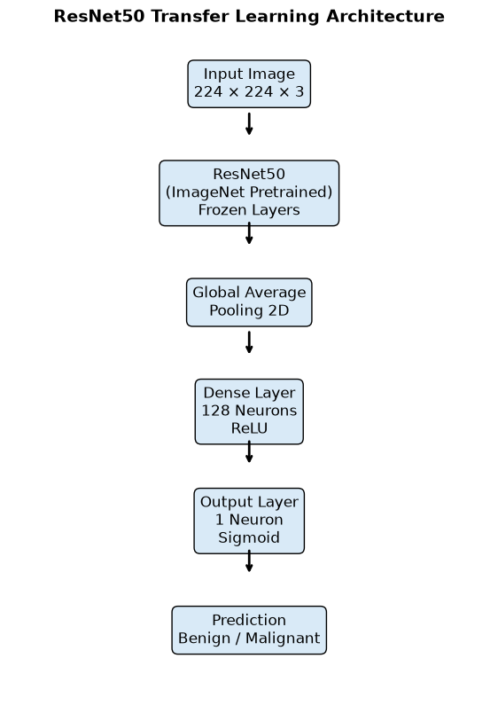
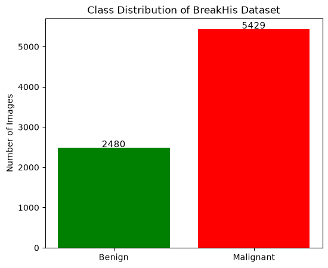
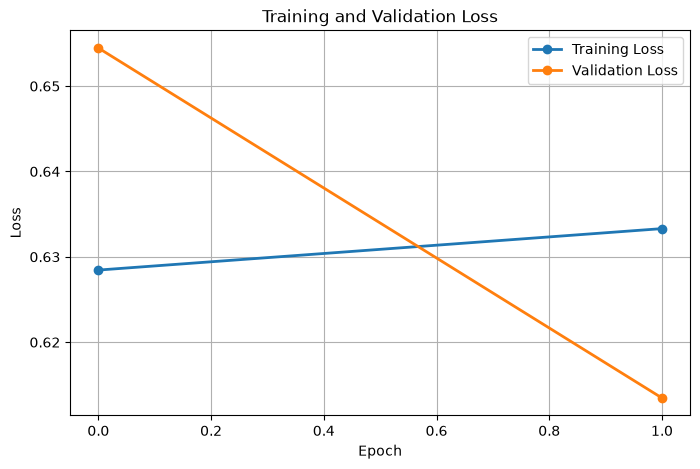
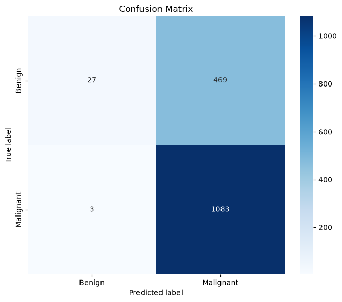
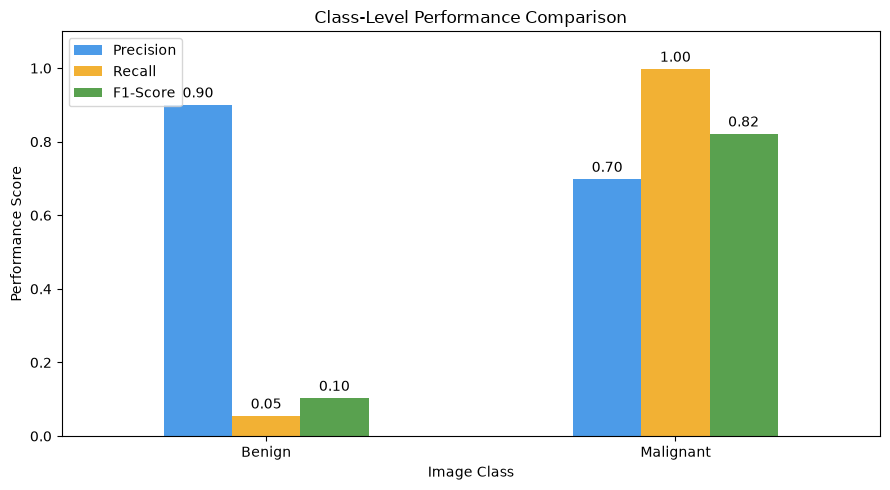
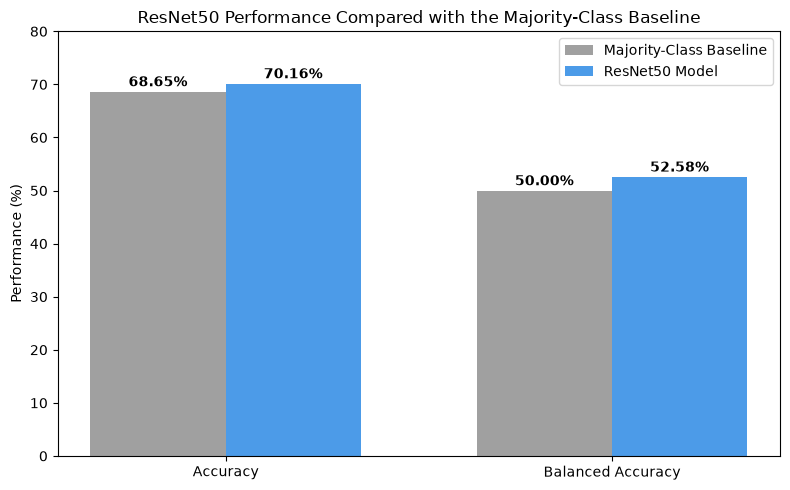

# Deep Learning-Based Breast Cancer Detection Using CNN

> Academic project: a ResNet50 transfer-learning model for binary classification of breast histopathology images.

## Overview

This project investigates deep learning for breast cancer image classification using the BreaKHis histopathological image dataset. The model classifies images into two classes:

- Benign
- Malignant

A pre-trained ResNet50 convolutional neural network was used as a feature extractor, with a custom binary classification layer.

## Dataset

The project uses the publicly available [BreaKHis dataset](https://www.kaggle.com/datasets/ambarish/breakhis).

The dataset contains:

- Benign images: 2,480
- Malignant images: 5,429
- Total images: 7,909

## Tools and Technologies

- Python
- Google Colab
- TensorFlow and Keras
- ResNet50
- Pandas and NumPy
- Matplotlib and Seaborn
- Scikit-learn

## Model Architecture



## Key Results

| Metric | Result |
|---|---:|
| Test accuracy | 70.16% |
| Majority-class baseline | 68.65% |
| Balanced accuracy | 52.58% |
| Malignant recall | 99.72% |
| Benign recall | 5.44% |

The results show strong malignant-case detection but poor benign-case recognition. Therefore, overall accuracy alone should not be treated as evidence of balanced classification performance.

## Project Figures

### Dataset Distribution



### Training and Validation Loss



### Confusion Matrix



### Class-Level Performance



### Baseline Comparison



## Repository Structure

```text
docs/        Final project report
images/      Project figures and visual outputs
notebooks/   Jupyter Notebook used for model development
README.md    Project overview and results
